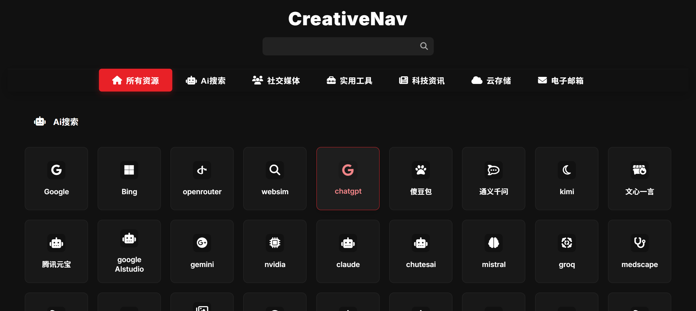

# WebNav Hub


一个优雅、简洁的网站导航中心 (CreativeNav)，帮助您快速访问常用网站。采用现代化暗色主题设计，支持响应式布局，提供流畅的用户体验。代码结构清晰，易于定制和部署。

## ✨ 特性

- 🎨 **现代化UI设计** - 红色点缀的暗色主题，优雅的卡片布局和流畅的动画效果
- 📱 **完全响应式** - 在任何设备上都能获得出色的浏览体验
- 📂 **文件分离** - HTML (`index.html`), CSS (`styles.css`), 和 JavaScript (`script.js`) 分离，便于维护和扩展
- 🔍 **分类导航与搜索** - 网站按类别组织，支持实时搜索过滤
- 🌙 **深色模式优先** - 默认深色主题，舒适护眼
- ⚡ **轻量且纯净** - 无需框架，纯HTML、CSS和JavaScript构建，移除了不必要的JS代码
- 🚀 **快速加载** - 优化的资源加载和简洁的代码确保快速渲染
- 🔧 **易于定制** - 清晰的CSS变量和HTML结构方便个性化修改

## 🖥️ 预览

*建议替换为项目实际截图*


## 🚀 部署指南

本项目提供两种文件结构供部署：

1.  **推荐：分离文件版** (`index.html`, `styles.css`, `script.js`) - 更易于维护和扩展。
2.  **备选：单文件版** (`nav.html`) - 将所有 CSS 和 JavaScript 内联在 HTML 中，方便在不支持多文件部署的简单环境中使用。

**选择您想部署的版本对应的文件进行操作。**

### 通过 Cloudflare Pages 部署

1.  Fork 这个仓库到您的 GitHub 账户。
2.  登录 [Cloudflare Dashboard](https://dash.cloudflare.com/)。
3.  进入 `Workers & Pages` > `Create application` > `Pages` > `Connect to Git`。
4.  选择您的仓库，点击 `Begin setup`。
5.  **项目名称** 自定义。**生产分支** 选择 `main`。
6.  **构建设置**:
    *   框架预设: 选择 `None`。
    *   构建命令: *留空*。
    *   构建输出目录: *留空* (如果部署分离文件版) 或设置为包含 `nav.html` 的目录（如果部署单文件版，通常也是根目录 `/`）。
    *   根目录: 保持 `/`。
7.  点击 `Save and Deploy`。

几分钟后，您的网站将在 `https://your-project-name.pages.dev` 上线。

### 通过 GitHub Pages 部署

1.  Fork 这个仓库到您的 GitHub 账户。
2.  进入仓库 `Settings` > `Pages`。
3.  在 `Build and deployment` 下的 `Source` 选择 `Deploy from a branch`。
4.  选择 `main` 分支和 `/(root)` 文件夹。
5.  点击 `Save`。

您的网站将在 `https://your-username.github.io/your-repo-name` 上线 (可能需要几分钟生效)。GitHub Pages 会自动寻找 `index.html`。如果您想部署 `nav.html` 作为主页，您需要将其重命名为 `index.html` 或配置 GitHub Pages 使用不同的入口文件（通常不直接支持）。

## 🔧 自定义 (以分离文件版为例)

### 添加新网站

编辑 `index.html` 文件，在相应的分类 `<section>` 内的 `.resource-grid` 中添加新的卡片结构：

```html
<!-- index.html -->
<div class="link-card" data-category="your-category-id"> <!-- 确保 data-category 匹配分类 -->
  <a href="https://your-website-url.com" target="_blank" aria-label="网站描述"></a>
  <div class="icon-wrapper">
    <i class="fa-brands fa-icon-name" aria-hidden="true"></i> <!-- 使用 Font Awesome 图标 -->
  </div>
  <h3>网站名称</h3>
</div>
```

### 修改颜色主题

编辑 `styles.css` 文件顶部的 `:root` 变量：

```css
/* styles.css */
:root {
  --primary-red: #e82127;        /* 主题红色 */
  --primary-red-hover: #ff2b2b;  /* 主题红色悬停 */
  --bg-main: #111;               /* 主要背景色 */
  --bg-card: #181818;             /* 卡片背景色 */
  /* ... 其他颜色变量 ... */
}
```

### 添加新分类

1.  **编辑 `index.html`**:
    *   在 `<main class="main">` 内添加新的 `<section>`：
        ```html
        <section id="new-category" class="category"> <!-- 使用唯一的ID -->
          <h2 class="category-title">
            <i class="fas fa-your-icon" aria-hidden="true"></i> <!-- 分类图标 -->
            新分类名称
          </h2>
          <div class="resource-grid">
            <!-- 在这里添加该分类下的网站卡片 -->
            <!-- <div class="link-card" data-category="new-category"> ... </div> -->
          </div>
        </section>
        ```
    *   在顶部的导航栏 `<nav class="navbar">` 内添加对应的按钮：
        ```html
        <button data-category="new-category" tabindex="0"> <!-- data-category 匹配 section 的 ID -->
          <i class="fas fa-your-icon" aria-hidden="true"></i>
          <span>新分类名称</span>
        </button>
        ```

2.  **编辑 `script.js` (如果需要)**: 通常不需要修改 JS 来添加新分类，现有逻辑会自动处理。

## 📝 许可证

本项目采用 [MIT 许可证](LICENSE)。

## 🙏 致谢

- [Font Awesome](https://fontawesome.com/) - 提供精美图标
- [Google Fonts](https://fonts.google.com/) - 提供优质字体
- [GitHub](https://github.com/) - 代码托管
- [Cloudflare](https://www.cloudflare.com/) - 网站部署和CDN服务

## 🔗 相关项目

- [原始项目](https://github.com/bbylw/p) - 本项目的灵感来源

---

<p align="center">Made with ❤️ by <a href="https://github.com/yourusername">Your Name</a></p>

> 本项目基于原始版本进行了优化和修改。
